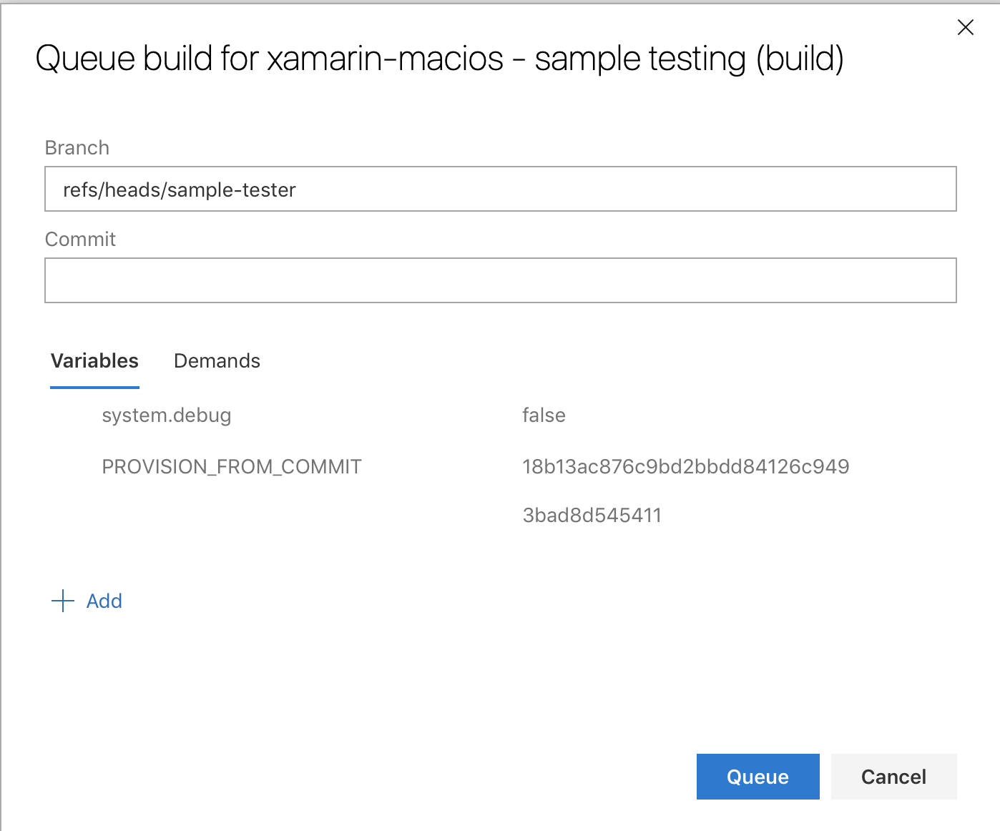

# Sample testing

These unit tests clone a series of known repositories with sample projects, and builds all the relevant projects in those repositories.

This is executed in Azure DevOps [here][1], but it must be triggered manually:

Queue:
* Branch: the branch to test.
* Commit: the commit in that branch to test.

Requirements:
* The commit in question must have already have packages (as GitHub statuses).

It's possible to use the sample tests from one commit, and then test with a
completely different commit, by setting the `PROVISION_FROM_COMMIT` variable
to the commit that's to be tested:

The previous point is still required: the commit to provision from must have packages.

[1]: https://dev.azure.com/xamarin/public/_build?definitionId=20
